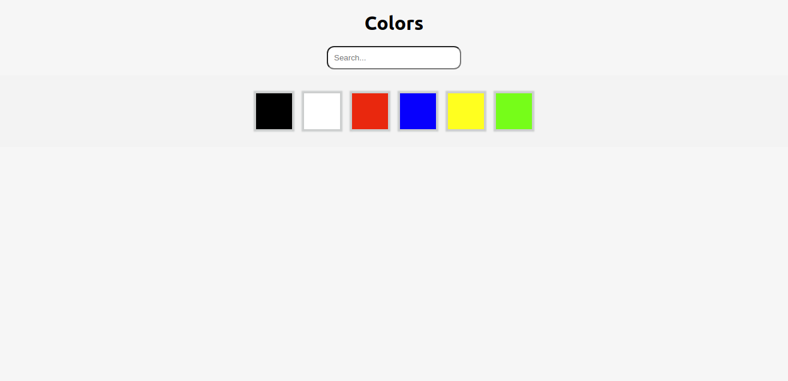

# Filter Colors

## Built With

- React
- JSX
- Webpack
- HTML5
- CSS3

## Getting Started

To get a local copy up and running follow these simple steps.

- [ ] Open your terminal
- [ ]  Navigate to the directory where you will like to install the repo by running `cd FOLDER-NAME` 
- [ ] Clone this repository
 > `git clone https://github.com/Div685/Filter-Color.git`
- [ ] run `npm install`
- [ ] run `npm start`
- [ ] The `npm start` command will redirect to your default browser, and in case it doesn't redirect automatically you can go to your favorite browser and run `http://localhost:3000/`.

## Author

👤 **Mian Faizan Ali Full Stack Programmer**

- GitHub: [@Faizanalifullstackprogrammer](https://github.com/Faizanalifullstackprogrammer)
- Twitter: [@mianfaizanali](https://twitter.com/mianfaizanali)
- LinkedIn: [Mianfaizanali](https://pk.linkedin.com/in/mianfaizanali)

## 🤝 Contributing

Contributions, issues, and feature requests are welcome!

Feel free to connect anytime

## 🤝 Contributing

Contributions, issues, and feature requests are welcome!

Feel free to check the [issues page](https://github.com/Div685/Filter-Color/issues).

## Show your support

Give a ⭐️ if you like this project!
